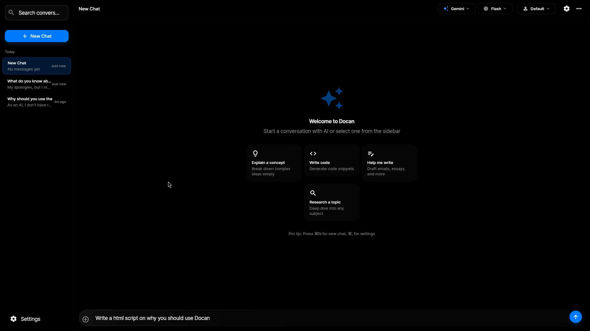
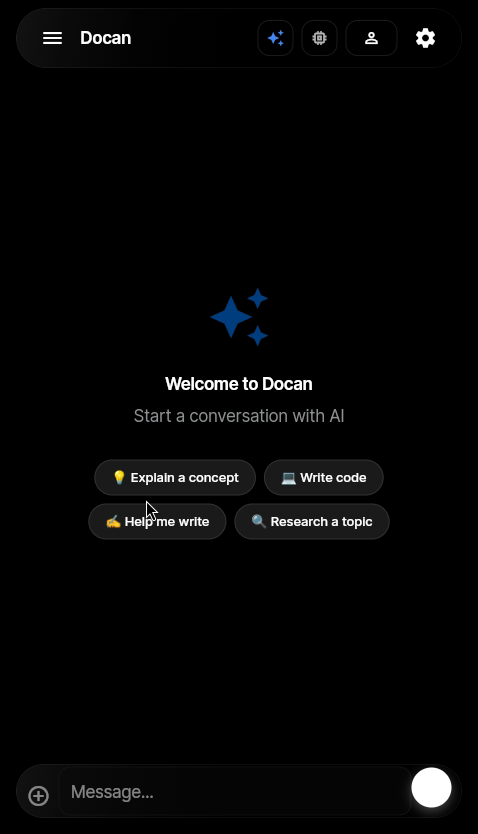

# Docan

<p align="center">
  
</p>

A multi-provider AI chat client with a clean Material Design UI that follows your system theme, with configurable accent colors. Runs on iOS, Android, macOS, Windows, Linux, and web.

## Features

- **Multi-provider support** — Gemini, ChatGPT, Claude, DeepSeek, OpenRouter, Ollama, and LM Studio in one app
- **OpenRouter integration** — Browse all OpenRouter vendors and their models with brand icons, via a three-level selector (provider → vendor → model)
- **Live model lists** — Model menus are populated from each provider's API, so only currently available models are listed; stale saved models self-heal automatically
- **Per-provider memory** — Each provider remembers its last-used model across restarts
- **Conversation history** — Save and organize your chats (stored in a dedicated file for fast saves)
- **Attachments** — Drag-and-drop images and documents (txt, pdf, docx, md, json, csv and more)
- **Playbooks** — Extend Docan with custom YAML-based API integrations
- **Image Creator** — Generate images with Gemini and DALL-E
- **Auto-retry** — Falls back to alternate models on rate limits
- **Local storage** — API keys stay on your device (keyring on Linux)
- **Markdown rendering** — Code blocks with syntax highlighting and LaTeX math
- **Responsive layout** — Works on phones and desktops, with dark mode and configurable accent colors

## Supported Providers

| Provider | Models | Type |
|----------|--------|------|
| Google Gemini | Gemini 3.8/3.7/3.6/3.5 Flash, Pro, Flash-Lite (fetched live) | Cloud |
| OpenAI | GPT-4o family (fetched live) | Cloud |
| OpenRouter | All vendors and models (fetched live, browsed by vendor) | Cloud |
| Anthropic | Claude Sonnet/Opus/Haiku 5.x (fetched live) | Cloud |
| DeepSeek | deepseek-chat, deepseek-reasoner | Cloud |
| Ollama | Any locally installed model | Local |
| LM Studio | Any loaded model (OpenAI-compatible) | Local |

## Screenshots

<p align="center">
  <br>
  <em>Desktop</em>
</p>

<p align="center">
  <br>
  <em>Mobile</em>
</p>

## Installation

### Linux (Arch-based)

```bash
yay -S docan-gtk-bin
```

### Linux (other)

Download the zip from [releases](https://github.com/ixnewton/docan/releases), unpack, and run `docan` (or install the AppImage/DEB from the same page).

### From Source

**Requirements:**
- Flutter SDK 3.10.3+
- Linux: `sudo apt install libsecret-1-dev libjsoncpp-dev`
- macOS: Xcode 15+
- Windows: Visual Studio 2022 with C++ workload

```bash
git clone https://github.com/ixnewton/docan.git
cd docan
flutter pub get
flutter run
```

## Building

```bash
# Debug
flutter run

# Release build
flutter build <platform>
# platform: apk, ios, macos, windows, linux, web
```

### Linux Packages

```bash
dart pub global activate flutter_distributor

# AppImage
flutter_distributor package --platform linux --targets appimage

# DEB
flutter_distributor package --platform linux --targets deb
```

## Setup

### API Keys

Go to Settings and add your keys:

- **Gemini** — [Google AI Studio](https://aistudio.google.com/apikey)
- **OpenAI** — [OpenAI Platform](https://platform.openai.com/api-keys)
- **OpenRouter** — [OpenRouter Keys](https://openrouter.ai/keys)
- **Claude** — [Anthropic Console](https://console.anthropic.com/)
- **DeepSeek** — [DeepSeek Platform](https://platform.deepseek.com/)
- **Ollama** — Runs locally at `http://localhost:11434`
- **LM Studio** — Runs locally at `http://localhost:1234/v1`

### Ollama

```bash
curl -fsSL https://ollama.ai/install.sh | sh
ollama pull llama3.2
```

## Playbooks

Playbooks are YAML files that extend Docan with custom API integrations. The AI can use them to fetch data, send webhooks, and interact with external services.

### Quick Example

```yaml
name: Weather
version: 1.0.0
playbookVersion: 1

config:
  apiKey:
    type: string
    secret: true
    required: true

triggers:
  - pattern: "weather in (?<city>.+)"

actions:
  getWeather:
    description: Get current weather
    parameters:
      city:
        type: string
        required: true
    steps:
      - type: http
        method: GET
        url: "https://api.weather.com/current?q={{params.city}}"
        headers:
          Authorization: "Bearer {{config.apiKey}}"
        response:
          store: weather
      - type: returnData
        value:
          temp: "{{weather.temp}}"
          condition: "{{weather.condition}}"
```

### Features

- **Trigger patterns** — Regex patterns to auto-activate playbooks
- **Multi-step execution** — Chain HTTP calls, transforms, conditions, and loops
- **Secure storage** — API keys stored in encrypted secure storage
- **Retry logic** — Configurable retries with delay per step
- **Progress streaming** — Real-time execution status updates
- **Dry run** — Validate before execution
- **Platform support** — Limit playbooks to specific platforms

### Usage

1. Go to **Playbooks** screen
2. Import a YAML file or create one
3. Configure required settings (API keys, etc.)
4. Enable the playbook
5. Chat naturally — playbooks activate automatically based on triggers
6. Or use `/playbook <name>` to invoke directly

See [docs/playbooks.md](docs/playbooks.md) for full documentation.

## Project Structure

```
lib/
├── main.dart
├── models/
│   ├── ai_provider.dart
│   ├── chat_message.dart
│   ├── conversation.dart
│   └── playbook.dart
├── services/
│   ├── ai_service.dart
│   ├── chat_service.dart
│   ├── gemini_service.dart
│   ├── openai_service.dart
│   ├── openrouter_service.dart
│   ├── claude_service.dart
│   ├── deepseek_service.dart
│   ├── ollama_service.dart
│   ├── lmstudio_service.dart
│   ├── image_generation_service.dart
│   ├── playbook_service.dart
│   ├── playbook_executor.dart
│   ├── clipboard_service.dart
│   └── storage_service.dart
├── screens/
│   ├── mobile/
│   └── desktop/
├── components/
│   ├── chat_bubble.dart
│   ├── chat_input.dart
│   ├── conversation_list.dart
│   ├── model_selector.dart
│   └── settings_form.dart
├── config/
│   ├── constants.dart
│   └── themes.dart
└── utils/
    ├── theme_provider.dart
    ├── file_processor.dart
    └── api_error_parser.dart
```

## Contributing

1. Fork the repo
2. Create a branch (`git checkout -b feature/your-feature`)
3. Commit changes
4. Push and open a PR

## License

AGPL-3.0 — see [LICENSE](LICENSE)
